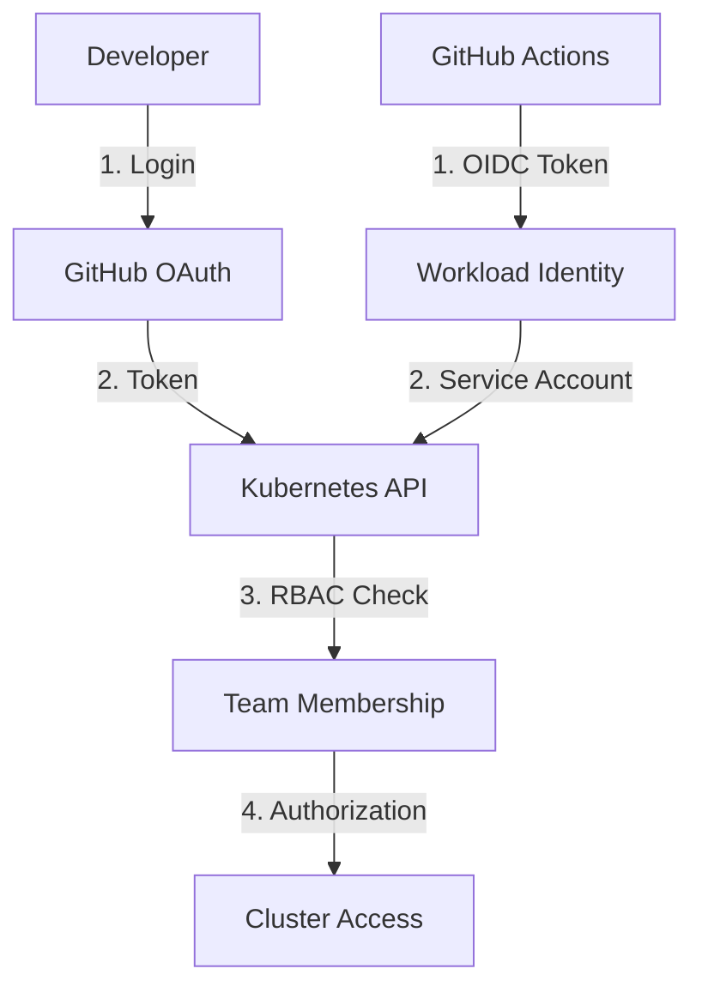

# ITL.K8s Documentation

Welcome to the ITlusions Kubernetes configuration documentation. This repository co| Issue | Quick Fix | Documentation |
|-------|-----------|---------------|
| Authentication failures | Check GitHub OAuth configuration | [GitHub Authentication](authentication/GITHUB_AUTHENTICATION.md#troubleshooting) |
| Authorization denied | Verify RBAC role bindings | [RBAC Best Practices](RBAC_BEST_PRACTICES.md#troubleshooting) |
| Storage issues | Check storage class and PVC status | [Storage Classes Guide](storageClasses/README.md#troubleshooting) |
| Pod deployment issues | Check security contexts and policies | [Pod Security Standards](POD_SECURITY.md) |
| Network connectivity | Review network policies | [Network Policies](NETWORK_POLICIES.md#debugging) | guides, configurations, and best practices for managing Kubernetes clusters and integrations.

## 🚀 Quick Start

New to our Kubernetes setup? Start here:

1. **[GitHub Authentication](authentication/GITHUB_AUTHENTICATION.md)** - Set up GitHub OAuth for Kubernetes cluster access
2. **[Storage Classes](storageClasses/README.md)** - Choose the right storage for your workloads
3. **[RBAC Configuration](#rbac-configuration)** - Configure role-based access control
4. **[Cluster Management](#cluster-management)** - Day-to-day cluster operations

## 📚 Documentation Index

### Authentication & Access Control

| Document | Description | When to Use |
|----------|-------------|-------------|
| **[GitHub Authentication](authentication/GITHUB_AUTHENTICATION.md)** | Complete guide for GitHub OAuth integration with Kubernetes | When setting up GitHub-based authentication for cluster access |
| **[RBAC Best Practices](RBAC_BEST_PRACTICES.md)** | Role-based access control configuration and management | For implementing proper authorization policies |
| **[Service Account Management](SERVICE_ACCOUNTS.md)** | Managing service accounts for applications and CI/CD | When configuring automated access to cluster resources |

### Storage & Data Management

| Document | Description | When to Use |
|----------|-------------|-------------|
| **[Storage Classes](storageClasses/README.md)** | Comprehensive guide to all available storage classes | When choosing storage for applications and databases |
| **[High Availability Database Storage](storageClasses/ha-dbs-lh.yaml)** | Production database storage configuration | For PostgreSQL, MySQL, and other critical databases |
| **[Longhorn Distributed Storage](storageClasses/longhorn.yaml)** | Default distributed storage for general use | For most application persistent volumes |
| **[MinIO Object Storage](storageClasses/minio-data.yaml)** | Object storage configuration | For MinIO tenants and object storage workloads |
| **[NFS Shared Storage](storageClasses/nfs-csi.yaml)** | Network file system storage | For shared volumes across multiple pods |

### Cluster Configuration

| Document | Description | When to Use |
|----------|-------------|-------------|
| **[Cluster Setup](CLUSTER_SETUP.md)** | Initial cluster configuration and hardening | When provisioning new clusters |
| **[Network Policies](NETWORK_POLICIES.md)** | Network segmentation and security policies | For implementing network-level security |
| **[Persistent Volume Management](PERSISTENT_VOLUMES.md)** | Advanced storage management and troubleshooting | When managing complex storage requirements |

### Monitoring & Observability

| Document | Description | When to Use |
|----------|-------------|-------------|
| **[Monitoring Setup](MONITORING.md)** | Prometheus, Grafana, and alerting configuration | For comprehensive cluster monitoring |
| **[Logging Configuration](LOGGING.md)** | Centralized logging with ELK or similar stacks | When implementing log aggregation |
| **[Health Checks](HEALTH_CHECKS.md)** | Application and cluster health monitoring | For proactive monitoring and alerting |

### CI/CD Integration

| Document | Description | When to Use |
|----------|-------------|-------------|
| **[GitHub Actions Integration](GITHUB_ACTIONS.md)** | CI/CD pipelines with GitHub Actions and OIDC | For automated deployments from GitHub |
| **[ArgoCD Integration](ARGOCD_INTEGRATION.md)** | GitOps workflows with ArgoCD | When implementing GitOps deployment patterns |
| **[Secrets Management](SECRETS_MANAGEMENT.md)** | Secure handling of secrets in CI/CD | For managing sensitive data in deployments |

### Security & Compliance

| Document | Description | When to Use |
|----------|-------------|-------------|
| **[Security Hardening](SECURITY_HARDENING.md)** | Cluster security best practices and configurations | For implementing security standards |
| **[Pod Security Standards](POD_SECURITY.md)** | Pod Security Standards implementation | When enforcing pod-level security policies |
| **[Audit Logging](AUDIT_LOGGING.md)** | Kubernetes audit logging configuration | For compliance and security monitoring |

## 🔧 Configuration Management

### Storage Classes Quick Reference

Our cluster provides multiple storage classes optimized for different workloads:

| Storage Class | Use Case | Performance | Availability | Best For |
|---------------|----------|-------------|--------------|----------|
| **`ha-dbs-lh`** | Production databases | High | Very High | PostgreSQL, MySQL, MongoDB |
| **`longhorn`** | General applications | High | High | Default choice for most workloads |
| **`openebs-hostpath`** | High-performance | Very High | Medium | Fast local storage, cache |
| **`minio-data`** | Object storage | Very High | Medium | MinIO tenants, large files |
| **`nfs-csi`** | Shared storage | Medium | High | Multi-pod access, configs |
| **`longhorn-static`** | Simple distributed | High | High | Basic storage needs |
| **`local-storage`** | Manual volumes | Very High | Low | Pre-allocated storage |

📖 **[Complete Storage Classes Documentation](storageClasses/README.md)**

### Infrastructure as Code

Our Kubernetes configurations are managed using:

- **Helm Charts** - For application packaging and templating
- **Kustomize** - For environment-specific configurations
- **GitOps** - Via ArgoCD for automated deployments
- **Terraform** - For infrastructure provisioning

### Environment Structure

| Environment | Purpose | Access Level |
|-------------|---------|--------------|
| **Development** | Feature development and testing | Developer teams |
| **Staging** | Integration testing and validation | QA and DevOps teams |
| **Production** | Live applications and services | Restricted admin access |

## 🛡️ Security Overview

### Authentication Flow

### Access Control Model

- **GitHub Teams** → **Kubernetes Groups** → **RBAC Roles**
- **Principle of Least Privilege** - Minimal required permissions
- **Time-bound Access** - Regular access reviews and token rotation
- **Audit Trail** - All actions logged and monitored

## 🔍 Troubleshooting

### Common Issues

| Issue | Quick Fix | Documentation |
|-------|-----------|---------------|
| Authentication failures | Check GitHub OAuth configuration | [GitHub Authentication](GITHUB_AUTHENTICATION.md#troubleshooting) |
| Authorization denied | Verify RBAC role bindings | [RBAC Best Practices](RBAC_BEST_PRACTICES.md#troubleshooting) |
| Pod deployment issues | Check security contexts and policies | [Pod Security Standards](POD_SECURITY.md) |
| Network connectivity | Review network policies | [Network Policies](NETWORK_POLICIES.md#debugging) |

### Emergency Procedures

- **[Break Glass Access](EMERGENCY_ACCESS.md)** - Emergency cluster access procedures
- **[Incident Response](INCIDENT_RESPONSE.md)** - Handling security incidents
- **[Disaster Recovery](DISASTER_RECOVERY.md)** - Backup and recovery procedures

## 📞 Support & Contact

### Getting Help

1. **Check Documentation** - Start with the relevant guide above
2. **Search Issues** - Look for similar problems in repository issues
3. **Team Channels** - Reach out in appropriate Slack channels
4. **Create Issue** - Document new problems for team visibility

### Team Contacts

- **Platform Team** - Overall cluster management and infrastructure
- **Security Team** - Security policies and compliance
- **DevOps Team** - CI/CD and deployment automation

## 🔄 Contributing

### Documentation Updates

1. **Fork Repository** - Create feature branch for changes
2. **Update Documentation** - Follow markdown style guide
3. **Test Changes** - Verify all links and examples work
4. **Submit PR** - Include clear description of changes

### Configuration Changes

1. **Follow GitOps** - All changes via pull requests
2. **Test in Development** - Validate changes in non-production
3. **Security Review** - Security team approval for sensitive changes
4. **Gradual Rollout** - Staged deployment to production

## 📈 Metrics & Monitoring

### Key Metrics

- **Cluster Health** - Node status, resource utilization
- **Application Performance** - Response times, error rates
- **Security Events** - Authentication failures, policy violations
- **Cost Optimization** - Resource usage and efficiency

### Dashboards

- **[Cluster Overview Dashboard](dashboards/cluster-overview.json)** - High-level cluster metrics
- **[Security Dashboard](dashboards/security-metrics.json)** - Security-related monitoring
- **[Cost Analysis Dashboard](dashboards/cost-analysis.json)** - Resource cost tracking

---

*This documentation is maintained by the ITlusions Platform Team. Last updated: September 2025*