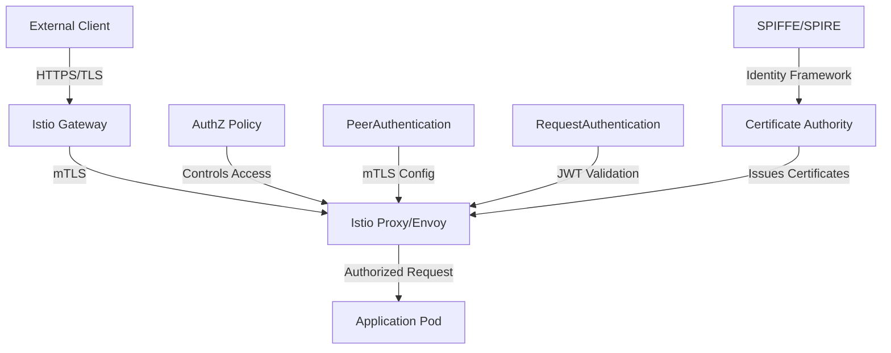

# Istio Security Configuration Guide

Welcome to the ITlusions Istio Security documentation. This guide covers Istio service mesh security configurations, best practices, and implementation patterns for securing microservices in Kubernetes.

## 🎯 Overview

Istio provides a comprehensive security model that addresses:

- **Authentication** (AuthN) - Verifying identity of clients and services
- **Authorization** (AuthZ) - Controlling access to resources
- **Traffic Management** - Secure routing and load balancing
- **Network Security** - mTLS encryption and network policies
- **Certificate Management** - Automated certificate lifecycle

## 🛡️ Security Architecture



## 📚 Documentation Structure

### Core Security Components

| Document | Description | Use Case |
|----------|-------------|----------|
| **[Authentication Policies](ISTIO_AUTHENTICATION.md)** | mTLS and JWT authentication configuration | Service-to-service and user authentication |
| **[Authorization Policies](ISTIO_AUTHORIZATION.md)** | Access control and traffic filtering | Fine-grained access control |
| **[Gateway Security](ISTIO_GATEWAY_SECURITY.md)** | Ingress and egress gateway security | External traffic security |
| **[Network Policies](ISTIO_NETWORK_SECURITY.md)** | Network-level security controls | Traffic isolation and encryption |
| **[Certificate Management](ISTIO_CERTIFICATE_MANAGEMENT.md)** | PKI and certificate lifecycle | Certificate rotation and management |

### Advanced Security Topics

| Document | Description | Use Case |
|----------|-------------|----------|
| **[Security Best Practices](ISTIO_SECURITY_BEST_PRACTICES.md)** | Comprehensive security guidelines | Security hardening and compliance |
| **[Multi-Tenant Security](ISTIO_MULTI_TENANT.md)** | Namespace and tenant isolation | Multi-tenant deployments |
| **[Troubleshooting Guide](ISTIO_SECURITY_TROUBLESHOOTING.md)** | Common security issues and solutions | Debugging security problems |
| **[Compliance & Auditing](ISTIO_COMPLIANCE.md)** | Security compliance and audit logging | Regulatory compliance |

## 🚀 Quick Start

### 1. Enable Istio Security Features

```bash
# Install Istio with security features
istioctl install --set values.pilot.env.ENABLE_WORKLOAD_ENTRY_AUTOREGISTRATION=true \
  --set values.pilot.env.PILOT_ENABLE_WORKLOAD_ENTRY_CROSS_CLUSTER=true
```

### 2. Enable Automatic mTLS

```yaml
# Enable strict mTLS for the entire mesh
apiVersion: security.istio.io/v1beta1
kind: PeerAuthentication
metadata:
  name: default
  namespace: istio-system
spec:
  mtls:
    mode: STRICT
```

### 3. Basic Authorization Policy

```yaml
# Deny all traffic by default
apiVersion: security.istio.io/v1beta1
kind: AuthorizationPolicy
metadata:
  name: deny-all
  namespace: production
spec: {}
```

### 4. Verify Security Configuration

```bash
# Check mTLS status
istioctl authn tls-check <pod-name>.<namespace>

# Verify authorization policies
istioctl proxy-config cluster <pod-name>.<namespace> --fqdn <service-fqdn>
```

## 🔧 Common Security Patterns

### Pattern 1: Subnet-Based Access Control

```yaml
apiVersion: security.istio.io/v1beta1
kind: AuthorizationPolicy
metadata:
  name: allow-trusted-subnet
  namespace: production
spec:
  selector:
    matchLabels:
      app: web-app
  action: ALLOW
  rules:
  - from:
    - source:
        ipBlocks:
        - 10.99.2.0/24    # Trusted internal subnet
        - 172.16.0.0/16   # Corporate network
```

### Pattern 2: Service-to-Service Authentication

```yaml
apiVersion: security.istio.io/v1beta1
kind: AuthorizationPolicy
metadata:
  name: service-auth
  namespace: production
spec:
  selector:
    matchLabels:
      app: backend-api
  action: ALLOW
  rules:
  - from:
    - source:
        principals: ["cluster.local/ns/production/sa/frontend-service"]
  - to:
    - operation:
        methods: ["GET", "POST"]
```

### Pattern 3: External Traffic Blocking

```yaml
apiVersion: networking.istio.io/v1beta1
kind: VirtualService
metadata:
  name: block-external-traffic
  namespace: production
spec:
  hosts:
  - api.example.com
  gateways:
  - production-gateway
  http:
  - fault:
      abort:
        percentage:
          value: 100.0
        httpStatus: 503
    match:
    - uri:
        prefix: "/"
    route:
    - destination:
        host: api-service
```

## 🔍 Security Monitoring

### Key Metrics to Monitor

- **mTLS Coverage** - Percentage of traffic using mTLS
- **Authentication Failures** - Failed authentication attempts
- **Authorization Denials** - Blocked requests due to policies
- **Certificate Expiry** - Upcoming certificate renewals
- **Security Policy Violations** - Policy enforcement failures

### Monitoring Commands

```bash
# Check mTLS status across the mesh
istioctl proxy-status

# View authentication metrics
kubectl logs -n istio-system deployment/istiod | grep "authentication"

# Monitor authorization decisions
kubectl logs -n istio-system deployment/istiod | grep "rbac"
```

## 🆘 Emergency Procedures

### Security Incident Response

1. **Immediate Actions**
   ```bash
   # Block all external traffic
   kubectl apply -f emergency-block-all.yaml
   
   # Enable strict security mode
   kubectl apply -f strict-security-mode.yaml
   ```

2. **Isolation Procedures**
   ```bash
   # Isolate compromised namespace
   kubectl apply -f namespace-isolation-policy.yaml
   
   # Revoke certificates if needed
   istioctl proxy-config secret <pod-name> -o json
   ```

3. **Recovery Steps**
   - Review audit logs
   - Update security policies
   - Rotate certificates
   - Gradual traffic restoration

## 📖 Related Documentation

- **[Kubernetes Security Guide](../authentication/GITHUB_AUTHENTICATION.md)** - Overall K8s security
- **[Network Policies](../networking/NETWORK_POLICIES.md)** - Kubernetes network security
- **[ArgoCD Security](../../ITL.ArgoCD/docs/index.md#security-features)** - GitOps security
- **[Keycloak Security](../../ITL.Keycloack.Tenants/docs/index.md#security)** - Identity management security

## 🤝 Support

For Istio security questions:

- **Platform Team**: [platform@itlusions.nl](mailto:platform@itlusions.nl)
- **Security Issues**: Create issue in [ITL.Istio repository](https://github.com/ITlusions/ITL.Istio)
- **Emergency**: Follow [incident response procedures](../INCIDENT_RESPONSE.md)

---

*This documentation is maintained by the ITlusions Platform Team. Last updated: September 2025*